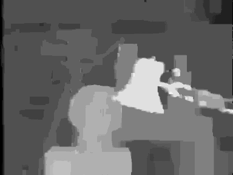

# Belief Propagation for Stereo Matching (Max-Product)

> **Repository Moved**  
> This project has been merged into [Loopy Belief Propagation for Stereo Matching (Sum-Product, Max-Product, Min-Sum)](https://github.com/aposb/belief-propagation-for-stereo).  
> The new repository contains the latest code, documentation, and updates.

A Matlab implementation of Loopy Belief Propagation for stereo matching. It uses the "Max-Product" variation of the algorithm and the "Synchronous" message update schedule.

## Input Image
The Tsukuba stereo image that used as input.

   

## Output Image
The disparity map that created at the output.

   

